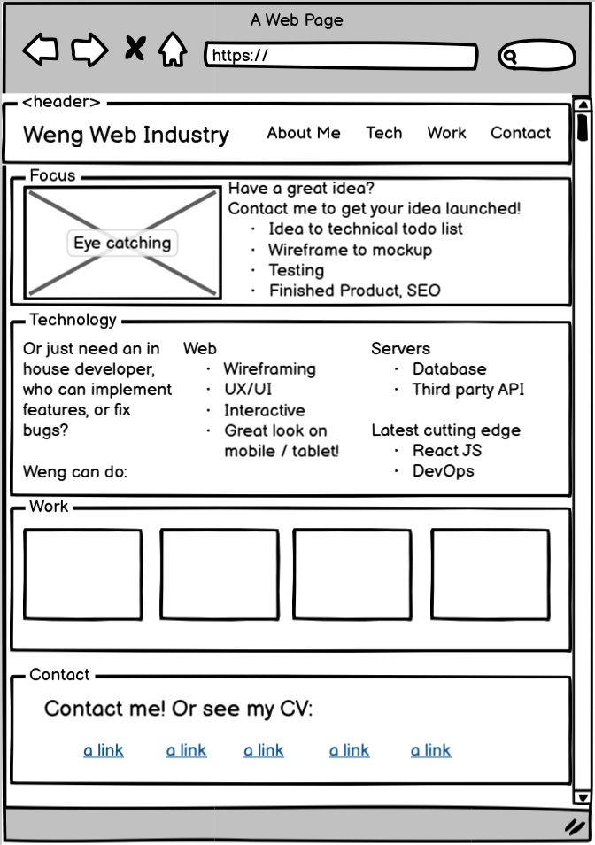
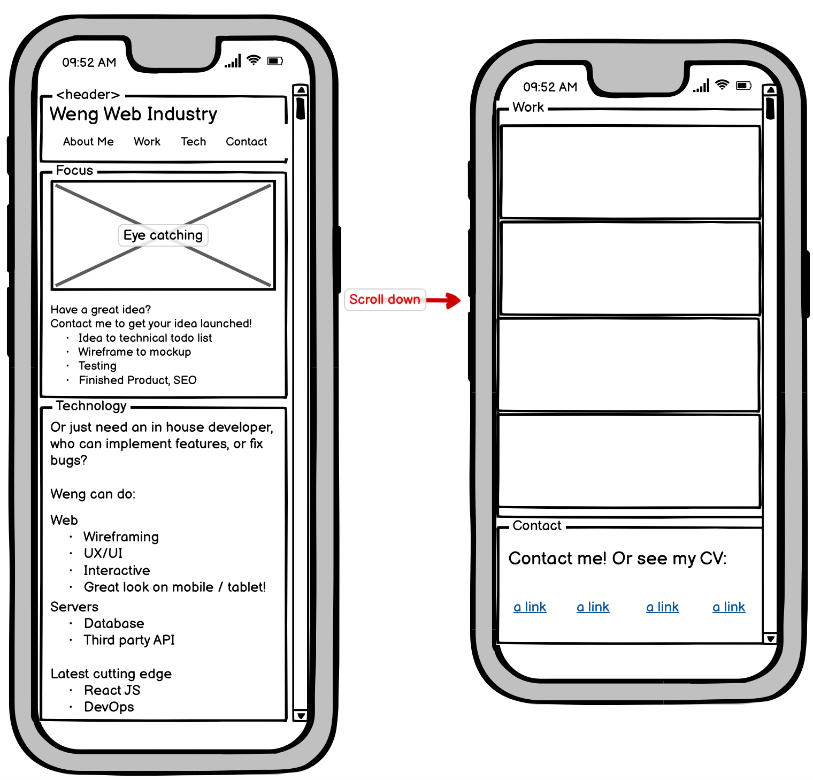

Weng's Web Industry
===
Do you want to implement your idea into a reality on the world wide web? Or do you need an in house developer that can understand your business' vision, implement features, and fix bugs? I am a full stack developer that can go from database to server to frontend. I know the latest cutting edge React JS, Accessibility, and SEO. This is my portfolio. If you are not convinced, contact me at weffung@ucdavis.edu or 323-842-7514 and let's have a chat.

Technology used on this portfolio
---
- NPM
- Livereload
- Compass
- CSS3
- HTML5

Wireframing
---
### Desktop

### Mobile
